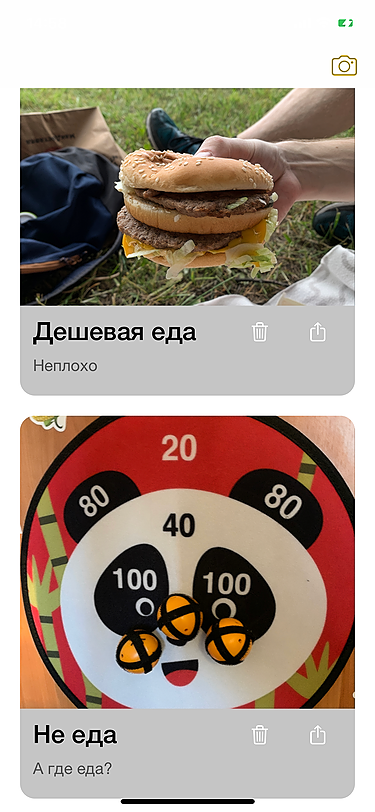
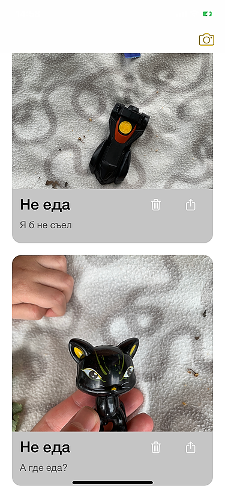
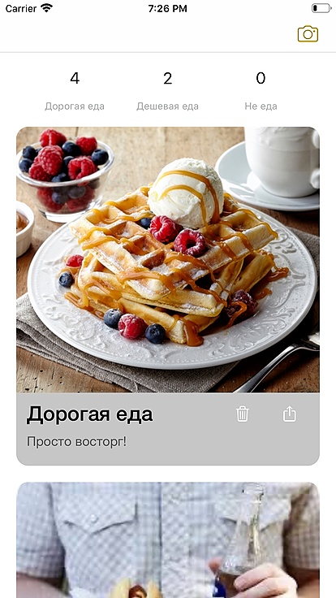

# :cake:FoodMeter
**Использует машинное обучение**

в AppStore: https://apps.apple.com/ru/app/foodmeter/id1528930688

Приложение позволяет на основе фотографии оценить к какой категории относится еда (‘дорогая’, ‘дешевая’ или ‘не еда’ ) и комментирует фото.

  |     

  
